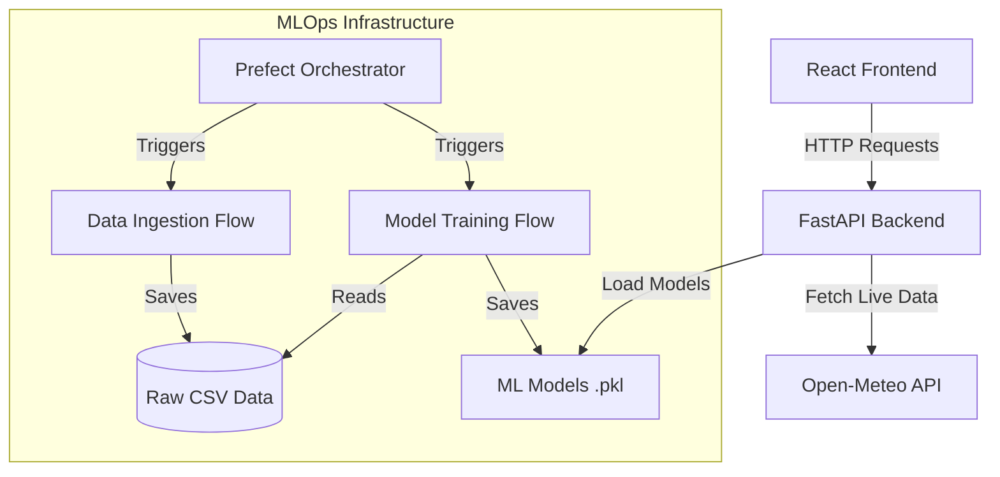
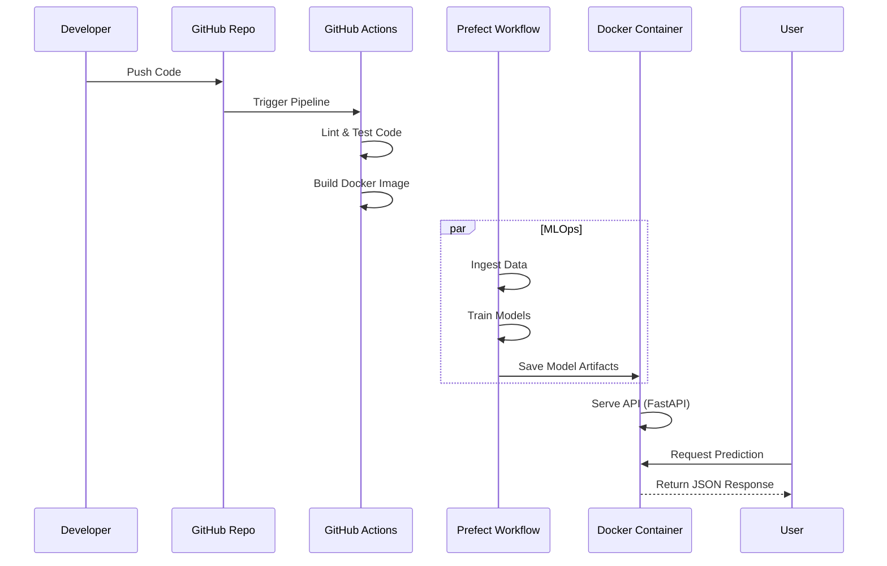

# Cloud Intelligence Platform - Project Report

**Project Title**: Design and Deploy an End-to-End Machine Learning System with FastAPI, CI/CD, Prefect, Automated Testing, and Docker Containerization
**Domain**: Earth & Environmental Intelligence
**Student Name**: Abdul Ahad Ali Khan
**Course**: AI321L Machine Learning (Lab)

---

## 1. Introduction & Problem Statement

### Problem Statement
In the era of climate change, access to real-time accurate environmental data is critical for urban planning, health monitoring, and disaster mitigation. Traditional systems often lack integration, providing fragmented data without predictive capabilities.

### Project Goal
To build a production-grade **Cloud Intelligence Platform** that provides real-time weather monitoring, air quality risk assessment, and pollution forecasting. The system integrates:
- **Data Ingestion**: Automated fetch of global weather/AQI data.
- **Machine Learning**: Classification (Risk), Regression (PM2.5), and Clustering (City Segmentation).
- **MLOps**: Automated pipelines for training, testing, and deployment.
- **User Interface**: A responsive React-based dashboard for visualization.

---

## 2. Machine Learning Experiments & Comparison

We trained multiple models for two key tasks using a historical dataset of 8 major global cities (London, NY, Tokyo, etc.).

### Task 1: Air Quality Risk Classification
Target: Predict `aqi_category` (Good, Moderate, Unhealthy, etc.) based on weather features.

| Model | Accuracy | F1-Score | Observation |
|-------|----------|----------|-------------|
| **Random Forest** | **0.8003** | **0.79** | **Best Performer.** Captured non-linear relationships best. |
| XGBoost | 0.7660 | 0.76 | Good, but slightly overfitted on this dataset size. |
| Logistic Regression | 0.5980 | 0.58 | Failed to capture complex weather interactions. |

### Task 2: Pollution Level Regression
Target: Predict `pm2_5` concentration.

| Model | RMSE (Lower is Better) | Observation |
|-------|------------------------|-------------|
| **Random Forest** | **25.35** | **Best Performer.** robust to outliers. |
| XGBoost | 26.36 | Very competitive, close second. |
| Linear Regression | 40.55 | High error, assumed linear relationship incorrectly. |

### Task 3: Clustering (City Segmentation)
Used **K-Means Clustering** on PCA-reduced features (Temperature, Humidity, Rain, PM2.5).
- **Cluster 0 (Low Pollution)**: Moderate temp, low PM2.5 (e.g., Zurich, Sydney).
- **Cluster 1 (Industrial)**: High PM2.5 concentrations (e.g., Delhi, Beijing).
- **Cluster 2 (Extreme)**: High temp/humidity variations.

---

## 3. System Architecture Diagram

The system follows a Microservices architecture containerized with Docker.



---

## 4. Containerization Workflow

We used **Docker** to ensure the application runs consistently across any environment.
*   **Dockerfile**: Defines the `python:3.9-slim` environment, installs dependencies (`requirements.txt`), and starts the FastAPI server (`uvicorn`).
*   **Docker Compose**: Orchestrates the service, linking volumes for model persistence.

```dockerfile
# Snippet of Dockerfile
FROM python:3.9-slim
WORKDIR /app
COPY requirements.txt .
RUN pip install -r requirements.txt
COPY . .
CMD ["uvicorn", "app.main:app", "--host", "0.0.0.0"]
```

---

## 5. CI/CD Pipeline Explanation

We implemented a Continuous Integration/Deployment pipeline using **GitHub Actions**.
**Workflow File**: `.github/workflows/ci_cd.yml`

**Stages:**
1.  **Trigger**: Pushes to `main` branch.
2.  **Linting**: Runs `flake8` to enforce code quality.
3.  **Automated Testing**: Runs `pytest` on API endpoints (mocking ML models).
4.  **Integration**: Runs `DeepChecks` for data integrity.
5.  **Build**: Builds the Docker image (`docker build`) to verify deployability.

---

## 6. Prefect Orchestration Flow

**Prefect** manages our data & ML workflows, providing retry logic and logging.
1.  **Ingestion Flow**: Fetches historical data for 8 cities, cleans it, and saves to CSV.
2.  **Training Flow**: 
    *   Loads & Preprocesses Data.
    *   Trains Classification, Regression, and Clustering models.
    *   Saves artifacts (`.pkl` files) for the API to verify.

---

## 7. Complete Methodology Flow Diagram



---

## 8. Final Observations & Future Work

### Observations
*   **Random Forest** proved to be the most robust model for this dataset, outperforming XGBoost slightly likely due to the dataset size (XGBoost thrives on larger data).
*   **Dockerization** eliminated "dependency hell", allowing the app to run immediately on any machine.
*   **Prefect** made the pipeline resilient; transient network errors during data fetching were handled automatically by retry logic.

### Limitations
*   **Data Volume**: We used a subset of historical data for demonstration.
*   **Condition Logic**: The "Weather Condition" label is currently a simplified heuristic (Rain vs Clear).

### Future Work
*   Integrate a **Vector Database** for RAG-based climate queries.
*   Deploy to **Kubernetes (K8s)** for auto-scaling.
*   Add **User Authentication** (OAuth2) for personalized dashboards.
